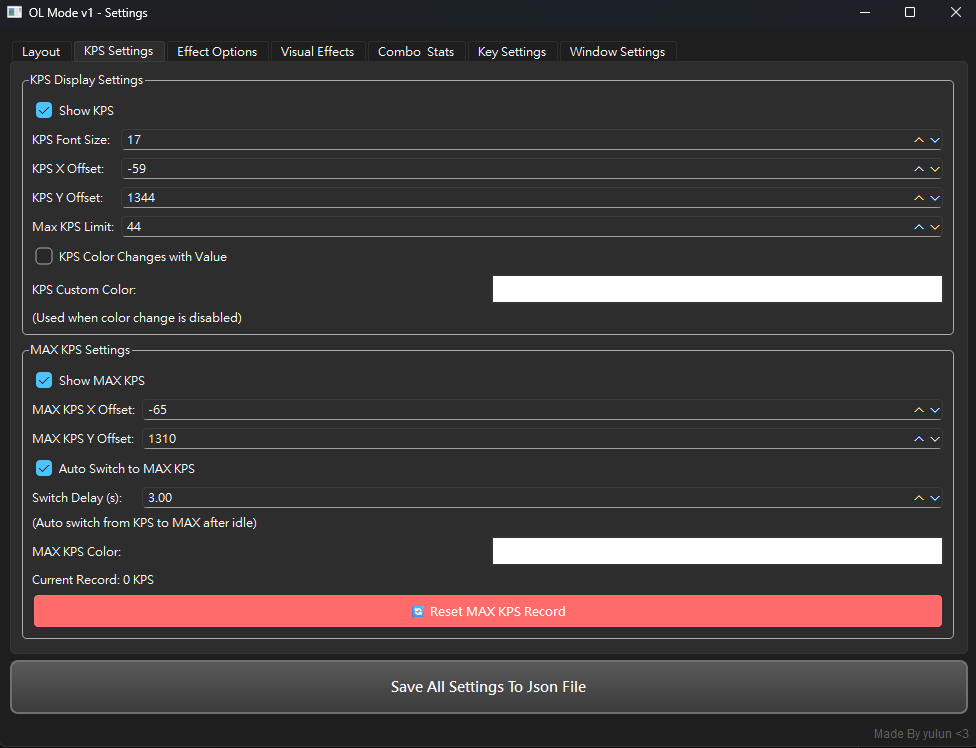
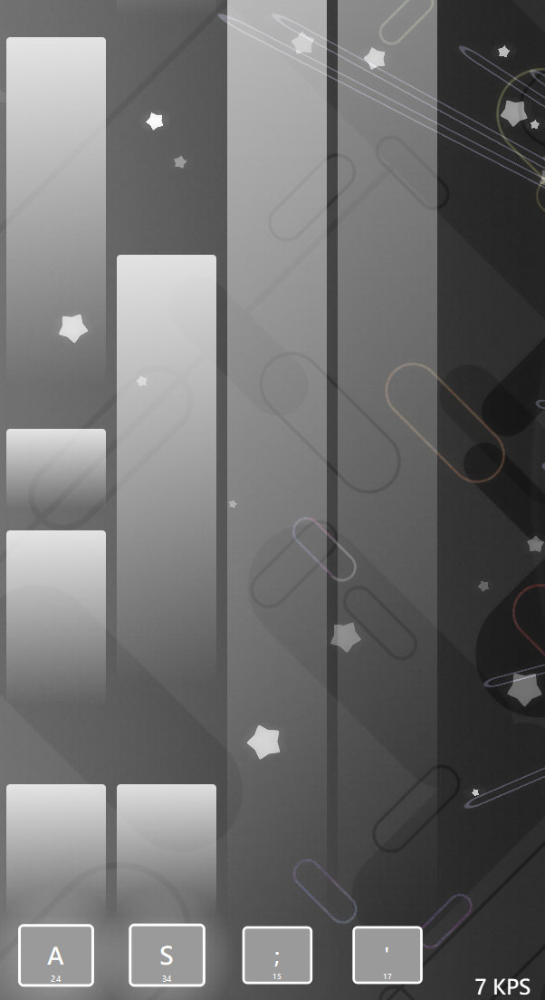

# osu! OL Mode - Keyboard Visualizer

A beautiful osu!mania keyboard press visualizer with customizable styles, particle effects, KPS display, and more.

## Updates

#2026/2/2
- Added adjustment to the location of a single button.
- Added a reset horizontal button.
- Remove unnecessary displays.
- Update all language text files.
- Improved GUI layout.
- Optimization logic.

## Features

- Real-time key press visualization
- KPS (Keys Per Second) display with MAX KPS tracking
- Multiple visual effects (particles, glow, trails)
- Rainbow mode
- Comprehensive settings interface
- Bilingual support (Traditional Chinese / English / More)
- Combo counter
- Statistics tracking
- Customizable key shapes and animations
- Real-time updated interface
- Much More...!

## Requirements

- Python 3.8 or higher
- Windows Operating System

## Installation

1. Install Python dependencies:

pip install PySide6 keyboard

2. Run the program:

python main.py

## How to Use

1. Launch the program - settings window will appear
2. Configure your monitored keys in the "Key Settings" tab
3. Adjust visual effects options as desired
4. Click "Save All Settings"
5. Start playing and enjoy the visual effects!

## Main Settings

- **Layout**: Key size, spacing, background opacity
- **KPS Settings**: Display position, font size, color changes, auto-switch to MAX
- **Physics & Style**: Animation styles, key shapes, rotation effects
- **Particles**: Count, gravity, explosion force, shapes (circle/square/star)
- **Visual Effects**: Glow, note visualization, trail effects
- **Colors**: Rainbow mode with customizable speed
- **Combo & Stats**: Combo counter, press statistics, session tracking

## Customization Options

### Animation Styles
- Default
- Wave
- Pulse
- Bounce
- Elastic
- Much More...!

### Key Shapes
- Rounded Rectangle
- Square
- Circle
- Hexagon
- Much More...!

### Particle Shapes
- Circle
- Square
- Star
- Much More...!

## 🔧 Configuration

All settings are saved in `osu_OL_v1_config.json` and persist between sessions.

# Screenshots
## Settings

## Preview

